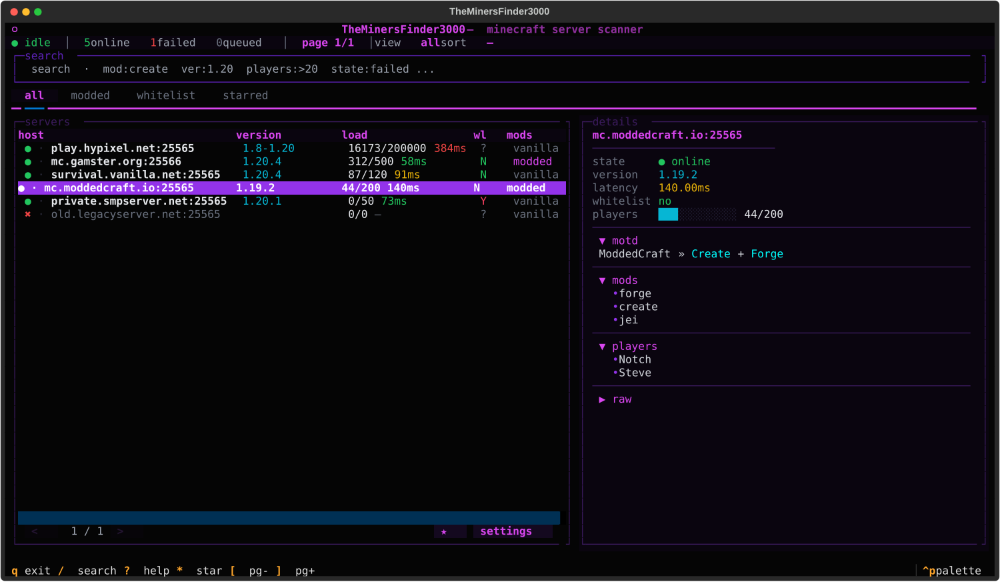

# TheMinersFinder3000

[English](README.md) · **Português (BR)**



Scanner de servidores Minecraft (Java) rápido e assíncrono, com interface em terminal. Lê uma lista de `host[:porta]`, mostra **status, versão, jogadores, latência, mods e whitelist** em tempo real e oferece filtros por query, ordenação, favoritos e exportação. Um cache local permite retomar scans grandes.

## Recursos

- **Scan assíncrono** com concorrência configurável.
- **Estado por host**: `queued → scanning → online / failed` (offline/falhos ficam visíveis).
- **Detecção de whitelist** por tentativa de login e leitura do motivo da desconexão.
- **Detecção de mods** (Forge `forgeData` e `modinfo`/`modList`).
- **MOTD colorido** — suporta códigos legados `§`, hex moderno `§x§R§R§G§G§B§B`, maiúsculos e `§k`.
- **Filtro por query**: `mod:create`, `ver:1.20`, `players:>20`, `ping:<50`, `wl:yes`, `state:failed`, `starred:1` + texto livre.
- **Abas**: todos / modded / whitelist / favoritos.
- **Ordenação** por jogadores, ping, versão ou nome (e por clique no cabeçalho da coluna).
- **Cache** (`.mcscan_cache.json`) com autosave e `--resume`.
- **Export** para JSON e CSV; copiar IP, mods e MOTD.
- **Tema**: neon fuchsia / purple / cyan.

## Instalação

Requer **Python 3.10+**.

```bash
# a partir do código
pip install -r requirements.txt   # ou: pip install mcstatus textual

# ou instalando o pacote (cria o comando `minersfinder`)
pip install -e .
```

Dependências: [`mcstatus`](https://github.com/py-mine/mcstatus) e [`textual`](https://github.com/Textualize/textual).

## Uso

```bash
# como módulo
python -m minersfinder hosts.txt

# comando instalado (pip install -e .)
minersfinder hosts.txt

# shim de compatibilidade (comando na raiz)
python3 main.py hosts.txt
```

Formato do arquivo de hosts (veja `hosts.example.txt`):

```
play.example.com
mc.example.net:25566
[2001:db8::1]:25565
{"ip": "10.0.0.5", "port": 25565}
```

### Opções de linha de comando

| Flag | Padrão | Descrição |
|---|---|---|
| `-t, --timeout` | `2.0` | Timeout de conexão (segundos) |
| `-c, --concurrency` | `400` | Máximo de verificações simultâneas |
| `-p, --port` | `25565` | Porta padrão |
| `--cache` | `.mcscan_cache.json` | Arquivo de cache |
| `--no-cache` | — | Não carrega scan anterior |
| `--resume` | — | Pula hosts já online no cache |
| `-o, --out` | `.` | Diretório de exportação |

## Atalhos

| Tecla | Ação |
|---|---|
| `/` ou `f` | Focar busca |
| `Esc` | Limpar busca |
| `Enter` | Focar tabela |
| `?` | Ajuda |
| `↑ ↓` | Navegar |
| `1 2 3 4` | Abas: all / modded / whitelist / starred (`d` / `w` atalhos) |
| `s p v n` | Ordenar por players / ping / version / nome |
| `*` | Favoritar |
| `c m t` | Copiar IP / mods / MOTD |
| `r` / `u` | Rescan do selecionado / dos falhos |
| `e` / `x` | Exportar JSON / CSV |
| `q` | Sair |

## Filtro (query)

Termos separados por espaço, combinados com **AND**. Termo solto = busca livre; `chave:valor` filtra por campo:

```
mod:create            # mods que contenham "create"
ver:1.20              # versão contém 1.20
host:mc.              # host contém "mc."
players:>20           # operadores: > < >= <= =
ping:<50
wl:yes                # yes / no / unknown (y/n/?)
state:failed          # queued / scanning / online / failed
starred:1
```

Ex.: `mod:create players:>10 ping:<80` mostra servidores modados com Create, 10+ jogadores e ping baixo.

## Estrutura do projeto

```
minersfinder/
├── __init__.py      # versão
├── __main__.py      # python -m minersfinder
├── cli.py           # argparse / entry point
├── app.py           # App Textual (UI, scan, cache, export)
├── app.tcss         # tema/CSS do Textual
├── widgets.py       # painel de detalhes + modal de ajuda
├── scanner.py       # check_host() e leitura do arquivo de hosts
├── protocol.py      # VarInt, handshake e probe de whitelist
├── motd.py          # parser de códigos de cor do Minecraft
├── query.py         # linguagem de filtro
├── models.py        # modelo de entrada do servidor
├── cache.py         # load/save do cache JSON
├── formatting.py    # helpers de Rich (latência, barra de players)
├── util.py          # clipboard
└── constants.py     # constantes e paleta de estados
```

O `main.py` na raiz é apenas um shim de compatibilidade.

## Licença

MIT — veja [LICENSE](LICENSE).
